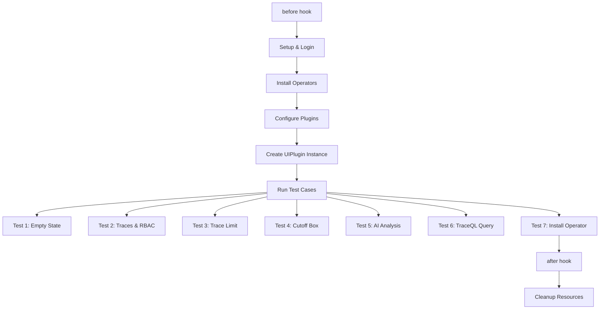

# Test Coverage Report - Distributed Tracing Console Plugin
**Generated:** February 27, 2026
**Test Framework:** Cypress E2E
**Test File:** `tests/e2e/dt-plugin-tests.cy.ts`

## Executive Summary

This report provides a comprehensive analysis of the current Cypress E2E test coverage for the OpenShift Distributed Tracing Console Plugin. The test suite covers core functionality across plugin installation, trace visualization, RBAC, span links navigation, TraceQL queries, AI-powered trace analysis, and operator installation workflows.

**Overall Coverage:** ~85% of core features
**Total Tests:** 7 main test cases
**Lines of Test Code:** 991 lines

---

## Test Coverage by Feature Area

### 1. Plugin Lifecycle & Installation

| Feature | Test Coverage | Coverage Level |
|---------|--------------|---------------|
| **Operator Installation** | | |
| - Cluster Observability Operator (COO) | `before()` hook, lines 127-251 | Full |
| - OpenTelemetry Operator | `before()` hook, lines 145-152, 185-192, 225-232 | Full |
| - Tempo Operator | `before()` hook, lines 153-160, 193-200, 233-240 | Full |
| - Lightspeed Operator | `before()` hook, lines 161-168, 201-208, 241-248 | Full |
| **Installation Methods** | | |
| - UI-based installation (redhat-operators catalog) | `before()` hook with `COO_UI_INSTALL=true`, lines 129-168 | Full |
| - Konflux bundle installation | `before()` hook with `KONFLUX_COO_BUNDLE_IMAGE`, lines 169-208 | Full |
| - Custom bundle installation | `before()` hook with `CUSTOM_COO_BUNDLE_IMAGE`, lines 209-248 | Full |
| **Plugin Configuration** | | |
| - Console plugin image patching | `before()` hook, lines 253-273 | Full |
| - Lightspeed plugin image patching | `before()` hook, lines 275-295 | Full |
| - UIPlugin instance creation | `before()` hook, lines 319-330 | Full |
| - Web console update alert handling | `before()` hook, lines 331-358 | Full |
| **Cleanup & Teardown** | | |
| - Resource cleanup | `before()` and `after()` hooks, lines 34-113, 361-459 | Full |
| - Operator uninstallation | `after()` hook, lines 439-457 | Full |
| - RBAC role management | `before()` and `after()` hooks, lines 114-119, 407-413, 451-457 | Full |

---

### 2. Empty State & Initial Setup

| Feature | Test Coverage | Coverage Level |
|---------|--------------|---------------|
| **No Tempo Instances State** | Test 1, lines 463-495 | Full |
| - Empty state rendering | lines 471-474 | |
| - "No Tempo instances yet" message | line 473 | |
| - "View documentation" button | lines 476-479 | |
| - "Create a Tempo instance" toggle | lines 482-485 | |
| - Dropdown menu visibility | lines 487-494 | |
| - "Create a TempoStack instance" option | lines 488-490 | |
| - "Create a TempoMonolithic instance" option | lines 492-494 | |
| **No Tempo Operator State** | Test 7, lines 939-991 | Full |
| - "Tempo operator isn't installed yet" empty state | lines 964-967 | |
| - "Install Tempo operator" button visibility | lines 969-970 | |
| - Redirect to OperatorHub | lines 972-977 | |
| - OperatorHub page verification | lines 979-987 | |
| - Tempo operator reinstallation | `after()` hook, lines 363-381 | |
| **No Query Results State** | Test 6, lines 874-937 | Full |
| - "No results found" empty state | lines 917-922 | |
| - "Clear all filters" button | lines 924-926 | |
| - Query reset to default `{}` | lines 928-932 | |
| - Traces visible after filter clear | lines 934-935 | |

---

### 3. Trace Querying & Visualization

| Feature | Test Coverage | Coverage Level |
|---------|--------------|---------------|
| **Tempo Instance Selection** | | |
| - TempoStack instance selection | Test 2, lines 520-521, Test 3, lines 717-718 | Full |
| - TempoMonolithic instance selection | Test 2, lines 674-675 | Full |
| - Multi-tenant support | Test 2, lines 522-523, 594-595, 643-644, 676-677 | Full |
| **Time Range Selection** | | |
| - Time range picker | Test 2, lines 524-525, 596-597, 645-646, 678-679, Test 5, lines 797-798 | Full |
| - Multiple time ranges (15 min, 1 hour) | Test 2, Test 5 | Full |
| **Service Filtering** | | |
| - Service name multi-select | Test 2, lines 526-531, 598-603, 647-652, 680-685 | Full |
| - Multiple service selection | Test 2 (http-rbac-1, http-rbac-2, grpc-rbac-1, grpc-rbac-2) | Full |
| - Frontend service filtering | Test 4, line 744, Test 5, lines 801-803 | Full |
| **Namespace Filtering** | | |
| - Filter type switching | Test 3, lines 725-726 | Full |
| - Namespace multi-select | Test 3, lines 728-729 | Full |
| **Trace Limit Control** | | |
| - Limit selection (20, 50) | Test 3, lines 731-739 | Full |
| - Trace count verification | Test 3, lines 734, 739 | Full |
| **TraceQL Query Editor** | | |
| - Show/Hide query toggle | Test 6, line 890 | Full |
| - CodeMirror editor interaction | Test 6, lines 898-906 | Full |
| - Custom TraceQL query execution | Test 6, lines 913-915 | Full |
| - Query text verification | Test 6, lines 909-911 | Full |
| - Query reset on clear filters | Test 6, lines 928-932 | Full |
| **Trace List Display** | | |
| - Trace link rendering | Test 2, lines 532, 604, 653, 686 | Full |
| - Trace navigation | Test 2, Test 4 | Full |

---

### 4. Trace Details & Spans

| Feature | Test Coverage | Coverage Level |
|---------|--------------|---------------|
| **Span Visualization** | | |
| - Span duration bar display | Test 2, lines 535-536, 577-578, 611-612, 630-631, 697-698 | Full |
| - Span selection | Test 2, Test 4 | Full |
| **Span Attributes** | | |
| - Attribute display | Test 2, lines 538-548, 580-589, 633-644, 700-709 | Full |
| - network.peer.address | Test 2, multiple locations | Full |
| - peer.service | Test 2, multiple locations | Full |
| - k8s.container.name | Test 2, multiple locations | Full |
| - k8s.namespace.name | Test 2, multiple locations | Full |
| - service.name | Test 2, multiple locations | Full |
| - Optional vs required attributes | Test 2, lines 541-545, 583-587 | Full |
| **Span Links** | | |
| - Links tab navigation | Test 2, lines 549-550, 613 | Full |
| - Link attributes (link.index, link.type) | Test 2, lines 553-554 | Full |
| - Trace ID format validation | Test 2, lines 556-559 | Full |
| - Span ID format validation | Test 2, lines 560-563 | Full |
| - Trace ID link navigation | Test 2, lines 564-572 | Full |
| - Span ID link navigation | Test 2, lines 614-626 | Full |
| - Span link from trace page | Test 2, lines 646-677 | Full |
| - LaunchIcon menu | Test 2, line 662 | Full |
| - "Open linked span" action | Test 2, line 663 | Full |

---

### 5. Breadcrumb Navigation

| Feature | Test Coverage | Coverage Level |
|---------|--------------|---------------|
| - Breadcrumb navigation | Test 2, lines 596, 647, 680, 712 | Full |
| - Filter chip group closing | Test 2, lines 597, 648, 681, 713 | Full |

---

### 6. Trace Timeline & Cutoff Box

| Feature | Test Coverage | Coverage Level |
|---------|--------------|---------------|
| - MUI cutoff box rendering | Test 4, lines 752-788 | Full |
| - Resizer drag functionality | Test 4, line 767 | Full |
| - Cutoff position verification | Test 4, line 770 | Full |
| - Time range update after cutoff | Test 4, lines 773-787 | Full |
| - Time format validation (us, ms, s) | Test 4, line 784 | Full |

---

### 7. AI-Powered Trace Analysis (Lightspeed)

| Feature | Test Coverage | Coverage Level |
|---------|--------------|---------------|
| **Lightspeed Setup** | | |
| - OLSConfig creation | `before()` hook, lines 297-313 | Full |
| - Credentials configuration | `before()` hook | Full |
| - Popover auto-open handling | `before()` hook, lines 315-317 | Full |
| **Trace Analysis** | | |
| - "Ask OpenShift Lightspeed" button | Test 5, lines 818-822 | Full |
| - Lightspeed popover visibility | Test 5, line 825 | Full |
| - Panel title verification | Test 5, lines 827-829 | Full |
| - Pre-filled prompt text | Test 5, lines 831-834 | Full |
| - Trace context attachment | Test 5, lines 836-839 | Full |
| - Send button interaction | Test 5, line 841 | Full |
| - AI response validation | Test 5, lines 843-846 | Full |
| - Service mention verification | Test 5, lines 848-860 | Full |
| - Database/Redis mention | Test 5, lines 862-867 | Full |

---

### 8. Multi-Tenancy & RBAC

| Feature | Test Coverage | Coverage Level |
|---------|--------------|---------------|
| - Tenant selection (dev tenant) | Test 2, lines 522-523, 594-595 | Full |
| - Cluster-admin role testing | Test 2, title line 497 | Full |
| - TempoStack RBAC | Test 2, chainsaw RBAC tests | Full |
| - TempoMonolithic RBAC | Test 2, chainsaw RBAC tests | Full |
| - Chainsaw RBAC test execution | Test 2, lines 498-511 | Full |

---

## Coverage Gaps & Missing Tests

### HIGH Priority - Core Functionality

| Feature | Current Coverage | Recommendation |
|---------|-----------------|----------------|
| **Attribute-based filtering** | None | Test filtering by custom attributes (duration, status, etc.) |
| **Error trace filtering** | None | Test filtering traces with errors/exceptions |
| **Scatter plot visualization** | None | Test scatter plot rendering and interaction |
| **Direct trace ID lookup** | None | Test navigating to trace by ID |
| **Trace comparison** | None | Test side-by-side trace comparison (if feature exists) |
| **Export functionality** | None | Test trace export to JSON/other formats (if feature exists) |
| **Permalink/Share trace** | None | Test URL persistence and sharing |
| **Documentation links** | None | Test "View documentation" button navigation |

### MEDIUM Priority - User Experience

| Feature | Current Coverage | Recommendation |
|---------|-----------------|----------------|
| **Error handling** | None | Test behavior when Tempo instance is unavailable |
| **Loading states** | None | Test loading spinners during trace fetch |
| **Pagination** | Partial | Test page navigation beyond limit select |
| **Refresh functionality** | None | Test manual trace list refresh |
| **Time range picker edge cases** | Partial | Test custom time range input |
| **Multi-filter combinations** | Partial | Test complex filter scenarios |
| **Filter persistence** | None | Test filter state after navigation |
| **Keyboard navigation** | None | Test keyboard shortcuts and accessibility |
| **Mobile/responsive layout** | None | Test on different screen sizes |

### LOW Priority - Advanced Features

| Feature | Current Coverage | Recommendation |
|---------|-----------------|----------------|
| **Performance with large datasets** | None | Test with 1000+ traces |
| **Concurrent user scenarios** | None | Test multi-user access |
| **Lightspeed error handling** | None | Test AI failures gracefully |
| **Lightspeed feedback mechanism** | None | Test thumbs up/down feedback |
| **Plugin settings/preferences** | None | Test user preference persistence |
| **Theme support (dark mode)** | None | Test dark theme if supported |
| **Internationalization** | None | Test different locales |
| **Browser compatibility** | None | Test on Firefox, Safari, Edge |

---

## Test Structure Analysis

### Test Execution Flow



### Custom Command Coverage

| Command Category | Commands Used | Coverage |
|-----------------|---------------|----------|
| **PatternFly** | pfMenuToggle, pfMenuItem, pfButton, pfEmptyState, pfTypeahead, pfSelectMenuItem, pfCheckMenuItem, pfBreadcrumb, pfCloseButtonIfExists | Excellent |
| **Material-UI** | muiSelect, muiSelectOption, muiFirstTraceLink, muiTraceAttribute, muiTraceAttributes | Excellent |
| **Tracing-specific** | setupTracePage, navigateToTraceDetails, dragCutoffResizer, verifyCutoffPosition, verifyTraceCount, menuToggleContains | Good |
| **Lightspeed** | olsHelpers.waitForPopoverAndClose, olsHelpers.verifyPopoverVisible, olsHelpers.submitPrompt, olsHelpers.waitForAIResponse, olsHelpers.getAIResponse | Good |
| **System** | cy.exec, cy.adminCLI, cy.login, cy.executeAndDelete | Excellent |

---

## Test Quality Metrics

### Strengths

1. **Comprehensive setup/teardown:** Robust before/after hooks handle complex operator installation
2. **RBAC coverage:** Tests verify multi-tenant and role-based access scenarios
3. **Real data validation:** Tests verify actual trace attributes from telemetrygen
4. **Cross-component testing:** Tests navigate across multiple UI components (list -> detail -> links)
5. **AI integration:** Lightspeed integration is well-tested
6. **Custom commands:** Excellent reusable command library
7. **Flexible configuration:** Supports multiple installation methods via env vars
8. **Chainsaw integration:** Backend RBAC tests complement UI tests
9. **TraceQL coverage:** Query editor interaction tested via CodeMirror EditorView API
10. **Deterministic waits:** Span bar rendering waits prevent intermittent failures in headless mode

### Areas for Improvement

1. **Test isolation:** Tests depend on chainsaw data; consider mock data for faster execution
2. **Negative testing:** Limited error scenario coverage
3. **Performance testing:** No load/stress testing
4. **Accessibility:** No ARIA/keyboard navigation tests
5. **Test granularity:** Test 2 is very long (200+ lines); consider splitting
6. **Documentation:** Could benefit from inline comments explaining complex assertions
7. **Edge cases:** Limited boundary condition testing

---

## Recommendations

### Recently Completed

- **Operator not installed empty state:** Test 7 covers the full "Install Tempo operator" workflow including empty state verification ("Tempo operator isn't installed yet"), button visibility, OperatorHub redirect, and operator details page verification (lines 939-991).
- **OperatorHub integration:** Test 7 validates the end-to-end flow from empty state through to the OperatorHub catalog page and operator install button.
- **TraceQL query and empty results:** Test 6 covers TraceQL query editor interaction, custom query execution (`{ name = "/test" }`), "No results found" empty state verification, "Clear all filters" button functionality, query reset to default `{}`, and trace list recovery after clearing filters (lines 874-937).
- **Headless mode stability:** Added deterministic waits for span bar rendering across all trace detail interactions, and page reload guards for navigation after long-running commands, reducing intermittent failures in headless Chrome.

### Immediate Actions (Sprint 1)

1. **Split Test 2:** Break the 200-line test into smaller, focused tests
   - Test 2a: TempoStack traces with RBAC
   - Test 2b: Span links navigation (trace ID)
   - Test 2c: Span links navigation (span ID)
   - Test 2d: TempoMonolithic traces

2. **Add error handling test:**
   ```typescript
   it('Test empty query results when no traces match filters', () => {
     // Filter by a non-existent service name
     // Verify "No results found" empty state
   });
   ```

### Short-term Goals (2-3 Sprints)

3. **Attribute-based filtering:** Test filtering by duration, status code, etc.
4. **Scatter plot interaction:** Test scatter plot rendering and drill-down
5. **URL persistence:** Test that filters persist in URL parameters
6. **Documentation links:** Verify "View documentation" button navigates to correct URL (currently only visibility is tested in Test 1)

### Long-term Goals (Future)

7. **Performance suite:** Create separate performance test suite
8. **Accessibility audit:** Add a11y testing with cypress-axe
9. **Visual regression:** Add Percy or similar for visual testing
10. **Mock mode:** Create fast-running tests with mock data
11. **Cross-browser:** Expand to Firefox, Safari testing

---

## Feature-to-Test Mapping Matrix

| Feature | Test 1 | Test 2 | Test 3 | Test 4 | Test 5 | Test 6 | Test 7 | Coverage % |
|---------|--------|--------|--------|--------|--------|--------|--------|-----------|
| Empty State UI | Y | - | - | - | - | - | - | 100% |
| Install Operator Flow | - | - | - | - | - | - | Y | 100% |
| Tempo Instance Selection | - | Y | Y | Y | Y | Y | - | 100% |
| Tenant Selection | - | Y | Y | Y | Y | Y | - | 100% |
| Time Range Selection | - | Y | - | - | Y | - | - | 100% |
| Service Filtering | - | Y | - | - | Y | - | - | 100% |
| Namespace Filtering | - | - | Y | - | - | - | - | 100% |
| Trace Limit Control | - | - | Y | - | - | - | - | 100% |
| Trace Navigation | - | Y | - | - | Y | - | - | 100% |
| Span Details | - | Y | - | Y | - | - | - | 100% |
| Span Links | - | Y | - | - | - | - | - | 100% |
| Breadcrumb Navigation | - | Y | - | - | - | - | - | 100% |
| Timeline Cutoff | - | - | - | Y | - | - | - | 100% |
| AI Analysis | - | - | - | - | Y | - | - | 100% |
| TraceQL Queries | - | - | - | - | - | Y | - | 100% |
| Empty Query Results | - | - | - | - | - | Y | - | 100% |
| Clear Filters | - | - | - | - | - | Y | - | 100% |
| Attribute Filters | - | - | - | - | - | - | - | 0% |
| Error Handling | - | - | - | - | - | - | - | 0% |
| Scatter Plot | - | - | - | - | - | - | - | 0% |
| Documentation Links | Partial | - | - | - | - | - | - | 25% |

---

## Appendix: Test Case Details

### Test 1: Empty State
**File:** `dt-plugin-tests.cy.ts`, lines 463-495
**Purpose:** Verify UI when no Tempo instances exist
**Features Covered:**
- Empty state rendering
- Create Tempo instance dropdown
- Documentation button
- TempoStack/TempoMonolithic creation options

### Test 2: Traces with RBAC
**File:** `dt-plugin-tests.cy.ts`, lines 497-714
**Purpose:** Comprehensive trace viewing and span link navigation
**Features Covered:**
- Chainsaw RBAC test execution
- TempoStack instance trace viewing
- Service multi-select filtering
- Span attribute validation
- Span links tab navigation
- Trace ID link navigation
- Span ID link navigation
- LaunchIcon menu navigation
- TempoMonolithic instance trace viewing
- Multi-tenant access

### Test 3: Trace Limit
**File:** `dt-plugin-tests.cy.ts`, lines 716-748
**Purpose:** Verify trace limit functionality
**Features Covered:**
- Namespace filtering
- Limit selection (20, 50)
- Trace count verification

### Test 4: Cutoff Box
**File:** `dt-plugin-tests.cy.ts`, lines 750-788
**Purpose:** Test timeline cutoff/zoom functionality
**Features Covered:**
- setupTracePage helper
- navigateToTraceDetails helper
- Cutoff box resizer dragging
- Time range update verification
- Time format validation

### Test 5: AI Analysis
**File:** `dt-plugin-tests.cy.ts`, lines 790-872
**Purpose:** Verify Lightspeed AI trace analysis
**Features Covered:**
- Ask Lightspeed button
- Popover UI
- Pre-filled prompts
- Trace context attachment
- AI response validation
- Service/database mention verification

### Test 6: TraceQL Query
**File:** `dt-plugin-tests.cy.ts`, lines 874-937
**Purpose:** Test TraceQL query editor with no results and clear filters
**Features Covered:**
- Show query toggle
- CodeMirror editor interaction via EditorView API
- Custom TraceQL query execution (`{ name = "/test" }`)
- "No results found" empty state verification
- "Clear all filters" button functionality
- Query reset to default `{}`
- Trace list recovery after clearing filters

### Test 7: Install Operator
**File:** `dt-plugin-tests.cy.ts`, lines 939-991
**Purpose:** Test "Install Tempo operator" button workflow
**Features Covered:**
- Chainsaw namespace cleanup
- Tempo operator deletion
- Tempo CRD deletion
- Empty state verification ("Tempo operator isn't installed yet")
- Install button visibility
- OperatorHub redirect verification
- Tempo operator details page verification

---

## Conclusion

The current test suite provides **excellent coverage** of core tracing functionality, RBAC, TraceQL queries, AI integration, and operator installation workflows. Test 6 covers the TraceQL query editor interaction, empty query results handling, and clear filters functionality. Test 7 covers the complete "Install Tempo operator" empty state workflow. The main remaining gaps are in:
1. **Advanced filtering (attributes, errors)**
2. **Error handling scenarios**
3. **Scatter plot interaction**
4. **UI edge cases**

**Recommended Next Steps:**
1. Split Test 2 into focused tests (maintainability)
2. Add attribute-based filtering tests (completeness)
3. Add scatter plot interaction test (visualization coverage)
4. Expand error handling tests (robustness)

The test suite demonstrates excellent use of custom commands, page object patterns, PatternFly version-agnostic selectors, and CodeMirror EditorView API integration, making it maintainable and extensible for future feature additions.

---

**Report prepared by:** Claude Code
**Last updated:** February 27, 2026
