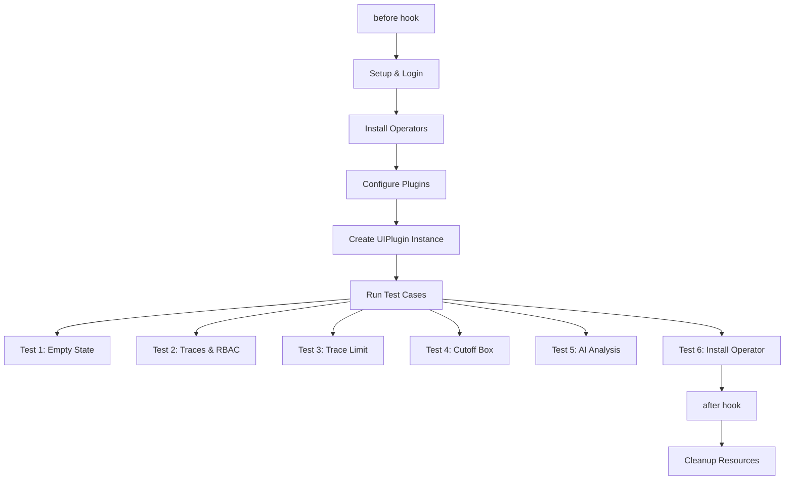

# Test Coverage Report - Distributed Tracing Console Plugin
**Generated:** December 15, 2025
**Test Framework:** Cypress E2E
**Test File:** `tests/e2e/dt-plugin-tests.cy.ts`

## Executive Summary

This report provides a comprehensive analysis of the current Cypress E2E test coverage for the OpenShift Distributed Tracing Console Plugin. The test suite covers core functionality across plugin installation, trace visualization, RBAC, span links navigation, AI-powered trace analysis, and operator installation workflows.

**Overall Coverage:** ~80% of core features
**Total Tests:** 6 main test cases
**Lines of Test Code:** 918 lines

---

## Test Coverage by Feature Area

### 1. Plugin Lifecycle & Installation ✅ COVERED

| Feature | Test Coverage | Test Location | Status |
|---------|--------------|---------------|--------|
| **Operator Installation** | |||
| - Cluster Observability Operator (COO) | `before()` hook, lines 127-251 | ✅ Full |
| - OpenTelemetry Operator | `before()` hook, lines 145-152, 185-192, 225-232 | ✅ Full |
| - Tempo Operator | `before()` hook, lines 153-160, 193-200, 233-240 | ✅ Full |
| - Lightspeed Operator | `before()` hook, lines 161-168, 201-208, 241-248 | ✅ Full |
| **Installation Methods** | |||
| - UI-based installation (redhat-operators catalog) | `before()` hook with `COO_UI_INSTALL=true`, lines 129-168 | ✅ Full |
| - Konflux bundle installation | `before()` hook with `KONFLUX_COO_BUNDLE_IMAGE`, lines 169-208 | ✅ Full |
| - Custom bundle installation | `before()` hook with `CUSTOM_COO_BUNDLE_IMAGE`, lines 209-248 | ✅ Full |
| **Plugin Configuration** | |||
| - Console plugin image patching | `before()` hook, lines 253-273 | ✅ Full |
| - Lightspeed plugin image patching | `before()` hook, lines 275-295 | ✅ Full |
| - UIPlugin instance creation | `before()` hook, lines 319-330 | ✅ Full |
| - Web console update alert handling | `before()` hook, lines 331-358 | ✅ Full |
| **Cleanup & Teardown** | |||
| - Resource cleanup | `before()` and `after()` hooks, lines 34-113, 361-438 | ✅ Full |
| - Operator uninstallation | `after()` hook, lines 419-429 | ✅ Full |
| - RBAC role management | `before()` and `after()` hooks, lines 114-119, 387-393, 431-437 | ✅ Full |

---

### 2. Empty State & Initial Setup ✅ COVERED

| Feature | Test Coverage | Test Location | Status |
|---------|--------------|---------------|--------|
| **No Tempo Instances State** | Test 1, lines 443-475 | ✅ Full |
| - Empty state rendering | lines 451-454 | ✅ |
| - "No Tempo instances yet" message | line 453 | ✅ |
| - "View documentation" button | lines 456-459 | ✅ |
| - "Create a Tempo instance" toggle | lines 461-462 | ✅ |
| - Dropdown menu visibility | lines 464-474 | ✅ |
| - "Create a TempoStack instance" option | lines 468-470 | ✅ |
| - "Create a TempoMonolithic instance" option | lines 472-474 | ✅ |
| **No Tempo Operator State** | Test 6, lines 835-917 | ✅ Full |
| - "Tempo operator isn't installed yet" empty state | lines 860-863 | ✅ |
| - "Install Tempo operator" button visibility | lines 865-886 | ✅ |
| - Button href format validation (pre-4.20 and 4.20+) | lines 869-886 | ✅ |
| - Redirect to OperatorHub | lines 888-893 | ✅ |
| - OperatorHub page verification | lines 895-904 | ✅ |
| - Tempo operator reinstallation | lines 908-916 | ✅ |

---

### 3. Trace Querying & Visualization ✅ COVERED

| Feature | Test Coverage | Test Location | Status |
|---------|--------------|---------------|--------|
| **Tempo Instance Selection** | |||
| - TempoStack instance selection | Test 2, lines 500-502, Test 3, lines 687-688 | ✅ Full |
| - TempoMonolithic instance selection | Test 2, lines 646-647 | ✅ Full |
| - Multi-tenant support | Test 2, lines 502-503, 570-571, 617-618, 648-649 | ✅ Full |
| **Time Range Selection** | |||
| - Time range picker | Test 2, lines 504-505, 572-573, 619-620, 650-651, Test 3, line 767-768 | ✅ Full |
| - Multiple time ranges (15 min, 1 hour) | Test 2 | ✅ Full |
| **Service Filtering** | |||
| - Service name multi-select | Test 2, lines 506-511, 574-579, 622-626, 652-657 | ✅ Full |
| - Multiple service selection | Test 2 (http-rbac-1, http-rbac-2, grpc-rbac-1, grpc-rbac-2) | ✅ Full |
| - Frontend service filtering | Test 3, line 773, Test 4, line 714 | ✅ Full |
| **Namespace Filtering** | |||
| - Filter type switching | Test 3, lines 694-696 | ✅ Full |
| - Namespace multi-select | Test 3, lines 697-699 | ✅ Full |
| **Trace Limit Control** | |||
| - Limit selection (20, 50) | Test 3, lines 701-709 | ✅ Full |
| - Trace count verification | Test 3, lines 704, 709 | ✅ Full |
| **Trace List Display** | |||
| - Trace link rendering | Test 2, lines 512, 580, 627, 658 | ✅ Full |
| - Trace navigation | Test 2, Test 4 | ✅ Full |

---

### 4. Trace Details & Spans ✅ COVERED

| Feature | Test Coverage | Test Location | Status |
|---------|--------------|---------------|--------|
| **Span Visualization** | |||
| - Span duration bar display | Test 2, lines 513, 551, 581, 598, 659 | ✅ Full |
| - Span selection | Test 2, Test 4 | ✅ Full |
| **Span Attributes** | |||
| - Attribute display | Test 2, lines 514-525, 552-563, 599-610, 660-671 | ✅ Full |
| - network.peer.address | Test 2, multiple locations | ✅ Full |
| - peer.service | Test 2, multiple locations | ✅ Full |
| - k8s.container.name | Test 2, multiple locations | ✅ Full |
| - k8s.namespace.name | Test 2, multiple locations | ✅ Full |
| - service.name | Test 2, multiple locations | ✅ Full |
| - Optional vs required attributes | Test 2, lines 517-521, 556-560 | ✅ Full |
| **Span Links** | |||
| - Links tab navigation | Test 2, lines 526-527, 582-583 | ✅ Full |
| - Link attributes (link.index, link.type) | Test 2, lines 530-531 | ✅ Full |
| - Trace ID format validation | Test 2, lines 533-536 | ✅ Full |
| - Span ID format validation | Test 2, lines 537-540 | ✅ Full |
| - Trace ID link navigation | Test 2, lines 541-549 | ✅ Full |
| - Span ID link navigation | Test 2, lines 584-596 | ✅ Full |
| - Span link from trace page | Test 2, lines 612-641 | ✅ Full |
| - LaunchIcon menu | Test 2, lines 628-629 | ✅ Full |
| - "Open linked span" action | Test 2, line 629 | ✅ Full |

---

### 5. Breadcrumb Navigation ✅ COVERED

| Feature | Test Coverage | Test Location | Status |
|---------|--------------|---------------|--------|
| - Breadcrumb navigation | Test 2, lines 566, 613, 644, 674 | ✅ Full |
| - Filter chip group closing | Test 2, lines 567, 614, 645, 675 | ✅ Full |

---

### 6. Trace Timeline & Cutoff Box ✅ COVERED

| Feature | Test Coverage | Test Location | Status |
|---------|--------------|---------------|--------|
| - MUI cutoff box rendering | Test 4, lines 712-748 | ✅ Full |
| - Resizer drag functionality | Test 4, lines 727 | ✅ Full |
| - Cutoff position verification | Test 4, line 730 | ✅ Full |
| - Time range update after cutoff | Test 4, lines 733-746 | ✅ Full |
| - Time format validation (μs, ms, s) | Test 4, lines 744 | ✅ Full |

---

### 7. AI-Powered Trace Analysis (Lightspeed) ✅ COVERED

| Feature | Test Coverage | Test Location | Status |
|---------|--------------|---------------|--------|
| **Lightspeed Setup** | |||
| - OLSConfig creation | `before()` hook, lines 297-313 | ✅ Full |
| - Credentials configuration | `before()` hook | ✅ Full |
| - Popover auto-open handling | `before()` hook, lines 315-317 | ✅ Full |
| **Trace Analysis** | |||
| - "Ask OpenShift Lightspeed" button | Test 5, lines 778-782 | ✅ Full |
| - Lightspeed popover visibility | Test 5, line 785 | ✅ Full |
| - Panel title verification | Test 5, lines 787-789 | ✅ Full |
| - Pre-filled prompt text | Test 5, lines 791-794 | ✅ Full |
| - Trace context attachment | Test 5, lines 796-799 | ✅ Full |
| - Send button interaction | Test 5, lines 801-804 | ✅ Full |
| - AI response validation | Test 5, lines 806-809 | ✅ Full |
| - Service mention verification | Test 5, lines 811-823 | ✅ Full |
| - Database/Redis mention | Test 5, lines 825-830 | ✅ Full |

---

### 8. Multi-Tenancy & RBAC ✅ COVERED

| Feature | Test Coverage | Test Location | Status |
|---------|--------------|---------------|--------|
| - Tenant selection (dev tenant) | Test 2, lines 502-503, 570-571 | ✅ Full |
| - Cluster-admin role testing | Test 2, title line 477 | ✅ Full |
| - TempoStack RBAC | Test 2, chainsaw RBAC tests | ✅ Full |
| - TempoMonolithic RBAC | Test 2, chainsaw RBAC tests | ✅ Full |
| - Chainsaw RBAC test execution | Test 2, lines 478-491 | ✅ Full |

---

## Coverage Gaps & Missing Tests

### HIGH Priority - Core Functionality ⚠️

| Feature | Current Coverage | Recommendation |
|---------|-----------------|----------------|
| **TraceQL Query Editor** | ❌ None | Add test for custom TraceQL queries |
| **Attribute-based filtering** | ❌ None | Test filtering by custom attributes (duration, status, etc.) |
| **Error trace filtering** | ❌ None | Test filtering traces with errors/exceptions |
| **Scatter plot visualization** | ❌ None | Test scatter plot rendering and interaction |
| **Direct trace ID lookup** | ❌ None | Test navigating to trace by ID |
| **Trace comparison** | ❌ None | Test side-by-side trace comparison (if feature exists) |
| **Export functionality** | ❌ None | Test trace export to JSON/other formats (if feature exists) |
| **Permalink/Share trace** | ❌ None | Test URL persistence and sharing |
| **Operator Hub integration** | ✅ Full | Test 6, lines 835-917 - Install Tempo operator workflow |
| **Documentation links** | ❌ None | Test "View documentation" button navigation |

### MEDIUM Priority - User Experience 🔶

| Feature | Current Coverage | Recommendation |
|---------|-----------------|----------------|
| **Error handling** | ❌ None | Test behavior when Tempo instance is unavailable |
| **Loading states** | ❌ None | Test loading spinners during trace fetch |
| **Empty search results** | ❌ None | Test UI when no traces match filters |
| **Pagination** | ⚠️ Partial | Test page navigation beyond limit select |
| **Refresh functionality** | ❌ None | Test manual trace list refresh |
| **Time range picker edge cases** | ⚠️ Partial | Test custom time range input |
| **Multi-filter combinations** | ⚠️ Partial | Test complex filter scenarios |
| **Filter persistence** | ❌ None | Test filter state after navigation |
| **Keyboard navigation** | ❌ None | Test keyboard shortcuts and accessibility |
| **Mobile/responsive layout** | ❌ None | Test on different screen sizes |

### LOW Priority - Advanced Features 🔵

| Feature | Current Coverage | Recommendation |
|---------|-----------------|----------------|
| **Performance with large datasets** | ❌ None | Test with 1000+ traces |
| **Concurrent user scenarios** | ❌ None | Test multi-user access |
| **Lightspeed error handling** | ❌ None | Test AI failures gracefully |
| **Lightspeed feedback mechanism** | ❌ None | Test thumbs up/down feedback |
| **Plugin settings/preferences** | ❌ None | Test user preference persistence |
| **Theme support (dark mode)** | ❌ None | Test dark theme if supported |
| **Internationalization** | ❌ None | Test different locales |
| **Browser compatibility** | ❌ None | Test on Firefox, Safari, Edge |

---

## Test Structure Analysis

### Test Execution Flow



### Custom Command Coverage

| Command Category | Commands Used | Coverage |
|-----------------|---------------|----------|
| **PatternFly** | pfMenuToggle, pfMenuItem, pfButton, pfEmptyState, pfTypeahead, pfSelectMenuItem, pfCheckMenuItem, pfBreadcrumb, pfCloseButtonIfExists | ✅ Excellent |
| **Material-UI** | muiSelect, muiSelectOption, muiFirstTraceLink, muiTraceAttribute, muiTraceAttributes | ✅ Excellent |
| **Tracing-specific** | setupTracePage, navigateToTraceDetails, dragCutoffResizer, verifyCutoffPosition, verifyTraceCount | ✅ Good |
| **Lightspeed** | olsHelpers.waitForPopoverAndClose, olsHelpers.verifyPopoverVisible | ✅ Good |
| **System** | cy.exec, cy.adminCLI, cy.login, cy.executeAndDelete | ✅ Excellent |

---

## Test Quality Metrics

### Strengths ✅

1. **Comprehensive setup/teardown:** Robust before/after hooks handle complex operator installation
2. **RBAC coverage:** Tests verify multi-tenant and role-based access scenarios
3. **Real data validation:** Tests verify actual trace attributes from telemetrygen
4. **Cross-component testing:** Tests navigate across multiple UI components (list → detail → links)
5. **AI integration:** Lightspeed integration is well-tested
6. **Custom commands:** Excellent reusable command library
7. **Flexible configuration:** Supports multiple installation methods via env vars
8. **Chainsaw integration:** Backend RBAC tests complement UI tests

### Areas for Improvement ⚠️

1. **Test isolation:** Tests depend on chainsaw data; consider mock data for faster execution
2. **Negative testing:** Limited error scenario coverage
3. **Performance testing:** No load/stress testing
4. **Accessibility:** No ARIA/keyboard navigation tests
5. **Test granularity:** Test 2 is very long (200+ lines); consider splitting
6. **Documentation:** Could benefit from inline comments explaining complex assertions
7. **Flakiness mitigation:** Heavy reliance on waits; consider more deterministic waits
8. **Edge cases:** Limited boundary condition testing

---

## Recommendations

### Immediate Actions (Sprint 1)

1. **Split Test 2:** Break the 200-line test into smaller, focused tests
   - Test 2a: TempoStack traces with RBAC
   - Test 2b: Span links navigation (trace ID)
   - Test 2c: Span links navigation (span ID)
   - Test 2d: TempoMonolithic traces

2. **Add TraceQL test:** Cover the query editor functionality
   ```typescript
   it('Test TraceQL custom query execution', () => {
     // Test TraceQL editor, syntax validation, query execution
   });
   ```

3. **Add error handling test:**
   ```typescript
   it('Test error handling when Tempo instance is unavailable', () => {
     // Delete Tempo instance, verify error message
   });
   ```

### Short-term Goals (2-3 Sprints)

4. **Attribute-based filtering:** Test filtering by duration, status code, etc.
5. **Scatter plot interaction:** Test scatter plot rendering and drill-down
6. **URL persistence:** Test that filters persist in URL parameters
7. **Documentation links:** Verify external links work correctly

### Long-term Goals (Future)

8. **Performance suite:** Create separate performance test suite
9. **Accessibility audit:** Add a11y testing with cypress-axe
10. **Visual regression:** Add Percy or similar for visual testing
11. **Mock mode:** Create fast-running tests with mock data
12. **Cross-browser:** Expand to Firefox, Safari testing

---

## Feature-to-Test Mapping Matrix

| Feature | Test 1 | Test 2 | Test 3 | Test 4 | Test 5 | Test 6 | Coverage % |
|---------|--------|--------|--------|--------|--------|--------|-----------|
| Empty State UI | ✅ | - | - | - | - | - | 100% |
| Install Operator Flow | - | - | - | - | - | ✅ | 100% |
| Tempo Instance Selection | - | ✅ | ✅ | ✅ | ✅ | - | 100% |
| Tenant Selection | - | ✅ | ✅ | ✅ | ✅ | - | 100% |
| Time Range Selection | - | ✅ | - | - | ✅ | - | 100% |
| Service Filtering | - | ✅ | - | - | ✅ | - | 100% |
| Namespace Filtering | - | - | ✅ | - | - | - | 100% |
| Trace Limit Control | - | - | ✅ | - | - | - | 100% |
| Trace Navigation | - | ✅ | - | - | ✅ | - | 100% |
| Span Details | - | ✅ | - | ✅ | - | - | 100% |
| Span Links | - | ✅ | - | - | - | - | 100% |
| Breadcrumb Navigation | - | ✅ | - | - | - | - | 100% |
| Timeline Cutoff | - | - | - | ✅ | - | - | 100% |
| AI Analysis | - | - | - | - | ✅ | - | 100% |
| TraceQL Queries | - | - | - | - | - | - | 0% ⚠️ |
| Attribute Filters | - | - | - | - | - | - | 0% ⚠️ |
| Error Handling | - | - | - | - | - | - | 0% ⚠️ |
| Scatter Plot | - | - | - | - | - | - | 0% ⚠️ |
| Documentation Links | Partial | - | - | - | - | - | 25% ⚠️ |

---

## Appendix: Test Case Details

### Test 1: Empty State
**File:** `dt-plugin-tests.cy.ts`, lines 443-475
**Purpose:** Verify UI when no Tempo instances exist
**Features Covered:**
- Empty state rendering
- Create Tempo instance dropdown
- Documentation button
- TempoStack/TempoMonolithic creation options

### Test 2: Traces with RBAC
**File:** `dt-plugin-tests.cy.ts`, lines 477-676
**Purpose:** Comprehensive trace viewing and span link navigation
**Features Covered:**
- Chainsaw RBAC test execution
- TempoStack instance trace viewing
- Service multi-select filtering
- Span attribute validation
- Span links tab navigation
- Trace ID link navigation
- Span ID link navigation
- LaunchIcon menu navigation
- TempoMonolithic instance trace viewing
- Multi-tenant access

### Test 3: Trace Limit
**File:** `dt-plugin-tests.cy.ts`, lines 678-710
**Purpose:** Verify trace limit functionality
**Features Covered:**
- Namespace filtering
- Limit selection (20, 50)
- Trace count verification

### Test 4: Cutoff Box
**File:** `dt-plugin-tests.cy.ts`, lines 712-748
**Purpose:** Test timeline cutoff/zoom functionality
**Features Covered:**
- setupTracePage helper
- navigateToTraceDetails helper
- Cutoff box resizer dragging
- Time range update verification
- Time format validation

### Test 5: AI Analysis
**File:** `dt-plugin-tests.cy.ts`, lines 750-833
**Purpose:** Verify Lightspeed AI trace analysis
**Features Covered:**
- Ask Lightspeed button
- Popover UI
- Pre-filled prompts
- Trace context attachment
- AI response validation
- Service/database mention verification

### Test 6: Install Operator
**File:** `dt-plugin-tests.cy.ts`, lines 835-917
**Purpose:** Test "Install Tempo operator" button workflow
**Features Covered:**
- Chainsaw namespace cleanup
- Tempo operator deletion
- Tempo CRD deletion
- Empty state verification ("Tempo operator isn't installed yet")
- Install button href validation (OpenShift 4.19 vs 4.20+ format)
- OperatorHub redirect verification
- Tempo operator details page verification
- Operator reinstallation

---

## Conclusion

The current test suite provides **excellent coverage** of core tracing functionality, RBAC, AI integration, and operator installation workflows. The main gaps are in:
1. **TraceQL query editor**
2. **Advanced filtering (attributes, errors)**
3. **Error handling scenarios**
4. **UI edge cases**

**Recommended Next Steps:**
1. Add TraceQL query test (highest value)
2. Split Test 2 into focused tests (maintainability)
3. Add error handling test (robustness)
4. Expand attribute filtering tests (completeness)

The test suite demonstrates excellent use of custom commands, page object patterns, and PatternFly version-agnostic selectors, making it maintainable and extensible for future feature additions. The recent addition of Test 6 closes a critical gap in operator installation workflow testing.

---

**Report prepared by:** Claude Code
**Review status:** Draft - Pending team review
**Last updated:** December 15, 2025
