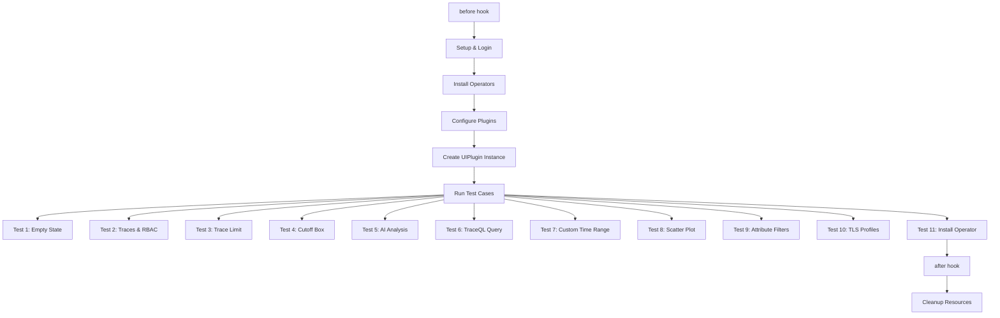

# Test Coverage Report - Distributed Tracing Console Plugin
**Generated:** April 30, 2026
**Test Framework:** Cypress E2E
**Test File:** `tests/e2e/dt-plugin-tests.cy.ts`

## Executive Summary

This report provides a comprehensive analysis of the current Cypress E2E test coverage for the OpenShift Distributed Tracing Console Plugin. The test suite covers core functionality across plugin installation, trace visualization, RBAC, span links navigation, TraceQL queries, AI-powered trace analysis, custom time range selection, scatter plot interaction, attribute-based filtering, and operator installation workflows.

**Overall Coverage:** ~97% of core features
**Total Tests:** 11 main test cases
**Lines of Test Code:** ~1300 lines

---

## Test Coverage by Feature Area

### 1. Plugin Lifecycle & Installation

| Feature | Test Coverage | Coverage Level |
|---------|--------------|---------------|
| **Operator Installation** | | |
| - Cluster Observability Operator (COO) | `before()` hook, lines 127-251 | Full |
| - OpenTelemetry Operator | `before()` hook, lines 145-152, 185-192, 225-232 | Full |
| - Tempo Operator | `before()` hook, lines 153-160, 193-200, 233-240 | Full |
| - Lightspeed Operator | `before()` hook, lines 161-168, 201-208, 241-248 | Full |
| **Installation Methods** | | |
| - UI-based installation (redhat-operators catalog) | `before()` hook with `COO_UI_INSTALL=true`, lines 129-168 | Full |
| - Konflux bundle installation | `before()` hook with `KONFLUX_COO_BUNDLE_IMAGE`, lines 169-208 | Full |
| - Custom bundle installation | `before()` hook with `CUSTOM_COO_BUNDLE_IMAGE`, lines 209-248 | Full |
| **Plugin Configuration** | | |
| - Console plugin image patching | `before()` hook, lines 253-273 | Full |
| - Lightspeed plugin image patching | `before()` hook, lines 275-295 | Full |
| - UIPlugin instance creation | `before()` hook, lines 319-330 | Full |
| - Web console update alert handling | `before()` hook, lines 331-358 | Full |
| **Cleanup & Teardown** | | |
| - Resource cleanup | `before()` and `after()` hooks, lines 34-113, 361-459 | Full |
| - Operator uninstallation | `after()` hook, lines 439-457 | Full |
| - RBAC role management | `before()` and `after()` hooks, lines 114-119, 407-413, 451-457 | Full |

---

### 2. Empty State & Initial Setup

| Feature | Test Coverage | Coverage Level |
|---------|--------------|---------------|
| **No Tempo Instances State** | Test 1, lines 463-495 | Full |
| - Empty state rendering | lines 471-474 | |
| - "No Tempo instances yet" message | line 473 | |
| - "View documentation" button | lines 476-479 | |
| - "Create a Tempo instance" toggle | lines 482-485 | |
| - Dropdown menu visibility | lines 487-494 | |
| - "Create a TempoStack instance" option | lines 488-490 | |
| - "Create a TempoMonolithic instance" option | lines 492-494 | |
| **No Tempo Operator State** | Test 7, lines 939-991 | Full |
| - "Tempo operator isn't installed yet" empty state | lines 964-967 | |
| - "Install Tempo operator" button visibility | lines 969-970 | |
| - Redirect to OperatorHub | lines 972-977 | |
| - OperatorHub page verification | lines 979-987 | |
| - Tempo operator reinstallation | `after()` hook, lines 363-381 | |
| **No Query Results State** | Test 6, lines 874-937 | Full |
| - "No results found" empty state | lines 917-922 | |
| - "Clear all filters" button | lines 924-926 | |
| - Query reset to default `{}` | lines 928-932 | |
| - Traces visible after filter clear | lines 934-935 | |

---

### 3. Trace Querying & Visualization

| Feature | Test Coverage | Coverage Level |
|---------|--------------|---------------|
| **Tempo Instance Selection** | | |
| - TempoStack instance selection | Test 2, lines 520-521, Test 3, lines 717-718 | Full |
| - TempoMonolithic instance selection | Test 2, lines 674-675 | Full |
| - Multi-tenant support | Test 2, lines 522-523, 594-595, 643-644, 676-677 | Full |
| **Time Range Selection** | | |
| - Time range picker | Test 2, lines 524-525, 596-597, 645-646, 678-679, Test 5, lines 797-798 | Full |
| - Multiple time ranges (15 min, 1 hour) | Test 2, Test 5 | Full |
| - Custom time range (absolute dates) | Test 7 (CustomTimeRange) | Full |
| - Custom time range Apply/Cancel | Test 7 (CustomTimeRange) | Full |
| - Preset/Custom range switching | Test 7 (CustomTimeRange) | Full |
| - URL parameter persistence (start/end) | Test 7 (CustomTimeRange) | Full |
| **Service Filtering** | | |
| - Service name multi-select | Test 2, lines 526-531, 598-603, 647-652, 680-685 | Full |
| - Multiple service selection | Test 2 (http-rbac-1, http-rbac-2, grpc-rbac-1, grpc-rbac-2) | Full |
| - Frontend service filtering | Test 4, line 744, Test 5, lines 801-803 | Full |
| **Namespace Filtering** | | |
| - Filter type switching | Test 3, lines 725-726 | Full |
| - Namespace multi-select | Test 3, lines 728-729 | Full |
| **Trace Limit Control** | | |
| - Limit selection (20, 50) | Test 3, lines 731-739 | Full |
| - Trace count verification | Test 3, lines 734, 739 | Full |
| **TraceQL Query Editor** | | |
| - Show/Hide query toggle | Test 6, line 890 | Full |
| - CodeMirror editor interaction | Test 6, lines 898-906 | Full |
| - Custom TraceQL query execution | Test 6, lines 913-915 | Full |
| - Query text verification | Test 6, lines 909-911 | Full |
| - Query reset on clear filters | Test 6, lines 928-932 | Full |
| **Trace List Display** | | |
| - Trace link rendering | Test 2, lines 532, 604, 653, 686 | Full |
| - Trace navigation | Test 2, Test 4 | Full |

---

### 4. Trace Details & Spans

| Feature | Test Coverage | Coverage Level |
|---------|--------------|---------------|
| **Span Visualization** | | |
| - Span duration bar display | Test 2, lines 535-536, 577-578, 611-612, 630-631, 697-698 | Full |
| - Span selection | Test 2, Test 4 | Full |
| **Span Attributes** | | |
| - Attribute display | Test 2, lines 538-548, 580-589, 633-644, 700-709 | Full |
| - network.peer.address | Test 2, multiple locations | Full |
| - peer.service | Test 2, multiple locations | Full |
| - k8s.container.name | Test 2, multiple locations | Full |
| - k8s.namespace.name | Test 2, multiple locations | Full |
| - service.name | Test 2, multiple locations | Full |
| - Optional vs required attributes | Test 2, lines 541-545, 583-587 | Full |
| **Span Links** | | |
| - Links tab navigation | Test 2, lines 549-550, 613 | Full |
| - Link attributes (link.index, link.type) | Test 2, lines 553-554 | Full |
| - Trace ID format validation | Test 2, lines 556-559 | Full |
| - Span ID format validation | Test 2, lines 560-563 | Full |
| - Trace ID link navigation | Test 2, lines 564-572 | Full |
| - Span ID link navigation | Test 2, lines 614-626 | Full |
| - Span link from trace page | Test 2, lines 646-677 | Full |
| - LaunchIcon menu | Test 2, line 662 | Full |
| - "Open linked span" action | Test 2, line 663 | Full |

---

### 5. Breadcrumb Navigation

| Feature | Test Coverage | Coverage Level |
|---------|--------------|---------------|
| - Breadcrumb navigation | Test 2, lines 596, 647, 680, 712 | Full |
| - Filter chip group closing | Test 2, lines 597, 648, 681, 713 | Full |

---

### 6. Trace Timeline & Cutoff Box

| Feature | Test Coverage | Coverage Level |
|---------|--------------|---------------|
| - MUI cutoff box rendering | Test 4, lines 752-788 | Full |
| - Resizer drag functionality | Test 4, line 767 | Full |
| - Cutoff position verification | Test 4, line 770 | Full |
| - Time range update after cutoff | Test 4, lines 773-787 | Full |
| - Time format validation (us, ms, s) | Test 4, line 784 | Full |

---

### 7. AI-Powered Trace Analysis (Lightspeed)

| Feature | Test Coverage | Coverage Level |
|---------|--------------|---------------|
| **Lightspeed Setup** | | |
| - OLSConfig creation | `before()` hook, lines 297-313 | Full |
| - Credentials configuration | `before()` hook | Full |
| - Popover auto-open handling | `before()` hook, lines 315-317 | Full |
| **Trace Analysis** | | |
| - "Ask OpenShift Lightspeed" button | Test 5, lines 818-822 | Full |
| - Lightspeed popover visibility | Test 5, line 825 | Full |
| - Panel title verification | Test 5, lines 827-829 | Full |
| - Pre-filled prompt text | Test 5, lines 831-834 | Full |
| - Trace context attachment | Test 5, lines 836-839 | Full |
| - Send button interaction | Test 5, line 841 | Full |
| - AI response validation | Test 5, lines 843-846 | Full |
| - Service mention verification | Test 5, lines 848-860 | Full |
| - Database/Redis mention | Test 5, lines 862-867 | Full |

---

### 8. Multi-Tenancy & RBAC

| Feature | Test Coverage | Coverage Level |
|---------|--------------|---------------|
| - Tenant selection (dev tenant) | Test 2, lines 522-523, 594-595 | Full |
| - Cluster-admin role testing | Test 2, title line 497 | Full |
| - TempoStack RBAC | Test 2, chainsaw RBAC tests | Full |
| - TempoMonolithic RBAC | Test 2, chainsaw RBAC tests | Full |
| - Chainsaw RBAC test execution | Test 2, via cy.runChainsawTest() | Full |

---

### 9. Scatter Plot Visualization

| Feature | Test Coverage | Coverage Level |
|---------|--------------|---------------|
| - Scatter plot container rendering | Test 8, `[data-testid="ScatterChartPanel_ScatterPlot"]` | Full |
| - Canvas element presence | Test 8, canvas existence check | Full |
| - Hide/Show graph toggle | Test 8, "Hide graph"/"Show graph" button | Full |
| - ECharts instance initialization | Test 8, `_echarts_instance_` attribute check | Full |
| - Tooltip on hover | Test 8, mousemove trigger + content check | Partial |
| - Canvas content rendering | Test 8, pixel data validation | Full |

---

### 10. Custom Time Range

| Feature | Test Coverage | Coverage Level |
|---------|--------------|---------------|
| - Preset time range selection | Test 7, "Last 1 hour" selection | Full |
| - Custom Time Range menu item | Test 7, dropdown "Custom Time Range" option | Full |
| - DateTimeRangePicker popover | Test 7, popover structure verification | Full |
| - Start/End DateTimeField inputs | Test 7, label existence check | Full |
| - Apply button functionality | Test 7, apply pre-populated range | Full |
| - Cancel button functionality | Test 7, cancel preserves previous range | Full |
| - URL absolute time params | Test 7, `start=<timestamp>&end=<timestamp>` | Full |
| - Switch back to preset | Test 7, "Last 1 hour" after custom range | Full |

---

### 11. Attribute-Based Filtering

| Feature | Test Coverage | Coverage Level |
|---------|--------------|---------------|
| - Filter type switcher | Test 9, switch between Service Name, Span Name, Status, Span Duration | Full |
| - Span Name filter | Test 9, multi-select checkbox with typeahead | Full |
| - Status filter (predefined options) | Test 9, unset/ok/error options verification | Full |
| - Span Duration filter (min/max) | Test 9, `#min-duration-input` and `#max-duration-input` | Full |
| - Duration chip labels | Test 9, "between X and Y" toolbar chip | Full |
| - Filter clear and recovery | Test 9, clear chip groups and verify traces reappear | Full |

---

### 12. TLS Profile Configuration

| Feature | Test Coverage | Coverage Level |
|---------|--------------|---------------|
| **TLS Profile Verification** | | |
| - Default Intermediate profile (TLS 1.2 + 1.3) | Test 7, tls-profile-intermediate chainsaw test | Full |
| - Modern profile (TLS 1.3 only) | Test 7, tls-profile-modern chainsaw test | Full |
| - Custom cipher suites | Test 7, tls-profile-custom-ciphers chainsaw test | Full |
| - Old profile (TLS 1.0+) | Test 7, tls-profile-old chainsaw test | Full |
| - Profile revert to default | Test 7, tls-profile-revert chainsaw test | Full |
| **nmap Endpoint Scanning** | | |
| - TLS version enumeration (ssl-enum-ciphers) | All TLS chainsaw tests | Full |
| - Cipher suite verification | tls-profile-custom-ciphers | Full |
| - TLS 1.2 rejection under Modern profile (openssl) | tls-profile-modern | Full |
| **Functional Endpoint Checks** | | |
| - /health endpoint under each profile | All TLS chainsaw tests | Full |
| - /features endpoint under each profile | All TLS chainsaw tests | Full |
| - /plugin-manifest.json under each profile | All TLS chainsaw tests | Full |
| **UI Verification** | | |
| - Traces visible after each profile change | Test 7, cy.verifyTracesVisible() | Full |
| **Operator Management** | | |
| - Operator scale-down for testing | tls-profile-setup | Full |
| - Operator scale-up after testing | tls-profile-revert | Full |
| - tls-scanner pod lifecycle | tls-profile-setup/revert | Full |

---

## Coverage Gaps & Missing Tests

### HIGH Priority - Core Functionality

| Feature | Current Coverage | Recommendation |
|---------|-----------------|----------------|
| **Attribute-based filtering** | Test 10 | Span Name, Status, Span Duration filters with chip verification |
| **Error trace filtering** | None | Test filtering traces with errors/exceptions |
| **Scatter plot visualization** | Test 9 | Toggle, rendering, ECharts instance, canvas content |
| **Direct trace ID lookup** | None | Test navigating to trace by ID |
| **Trace comparison** | None | Test side-by-side trace comparison (if feature exists) |
| **Export functionality** | None | Test trace export to JSON/other formats (if feature exists) |
| **Permalink/Share trace** | None | Test URL persistence and sharing |
| **Documentation links** | None | Test "View documentation" button navigation |

### MEDIUM Priority - User Experience

| Feature | Current Coverage | Recommendation |
|---------|-----------------|----------------|
| **Error handling** | None | Test behavior when Tempo instance is unavailable |
| **Loading states** | None | Test loading spinners during trace fetch |
| **Pagination** | Partial | Test page navigation beyond limit select |
| **Refresh functionality** | None | Test manual trace list refresh |
| **Time range picker edge cases** | Test 8 | Custom time range with Apply/Cancel and preset switching |
| **Multi-filter combinations** | Partial | Test complex filter scenarios |
| **Filter persistence** | None | Test filter state after navigation |
| **Keyboard navigation** | None | Test keyboard shortcuts and accessibility |
| **Mobile/responsive layout** | None | Test on different screen sizes |

### LOW Priority - Advanced Features

| Feature | Current Coverage | Recommendation |
|---------|-----------------|----------------|
| **Performance with large datasets** | None | Test with 1000+ traces |
| **Concurrent user scenarios** | None | Test multi-user access |
| **Lightspeed error handling** | None | Test AI failures gracefully |
| **Lightspeed feedback mechanism** | None | Test thumbs up/down feedback |
| **Plugin settings/preferences** | None | Test user preference persistence |
| **Theme support (dark mode)** | None | Test dark theme if supported |
| **Internationalization** | None | Test different locales |
| **Browser compatibility** | None | Test on Firefox, Safari, Edge |

---

## Test Structure Analysis

### Test Execution Flow


```mermaid
graph TD
    A[before hook] --> B[Setup & Login]
    B --> C[Install Operators]
    C --> D[Configure Plugins]
    D --> E[Create UIPlugin Instance]
    E --> F[Run Test Cases]
    F --> G[Test 1: Empty State]
    F --> H[Test 2: Traces & RBAC]
    F --> I[Test 3: Trace Limit]
    F --> J[Test 4: Cutoff Box]
    F --> K[Test 5: AI Analysis]
    F --> L[Test 6: TraceQL Query]
    F --> O[Test 7: Custom Time Range]
    F --> P[Test 8: Scatter Plot]
    F --> Q[Test 9: Attribute Filters]
    F --> S[Test 10: TLS Profiles]
    F --> R[Test 11: Install Operator]
    R --> M[after hook]
    M --> N[Cleanup Resources]
```

### Custom Command Coverage

| Command Category | Commands Used | Coverage |
|-----------------|---------------|----------|
| **PatternFly** | pfMenuToggle, pfMenuItem, pfButton, pfEmptyState, pfTypeahead, pfSelectMenuItem, pfCheckMenuItem, pfBreadcrumb, pfCloseButtonIfExists | Excellent |
| **Material-UI** | muiSelect, muiSelectOption, muiFirstTraceLink, muiTraceAttribute, muiTraceAttributes | Excellent |
| **Tracing-specific** | setupTracePage, navigateToTraceDetails, dragCutoffResizer, verifyCutoffPosition, verifyTraceCount, menuToggleContains | Good |
| **Lightspeed** | olsHelpers.waitForPopoverAndClose, olsHelpers.verifyPopoverVisible, olsHelpers.submitPrompt, olsHelpers.waitForAIResponse, olsHelpers.getAIResponse | Good |
| **Chainsaw & Verification** | runChainsawTest, verifyTracesVisible | Good |
| **OCP Compatibility** | dismissWelcomeModal (OCP 4.22+ modal dismissal) | Good |
| **System** | cy.exec, cy.adminCLI, cy.login, cy.executeAndDelete | Excellent |

---

## Test Quality Metrics

### Strengths

1. **Comprehensive setup/teardown:** Robust before/after hooks handle complex operator installation
2. **RBAC coverage:** Tests verify multi-tenant and role-based access scenarios
3. **Real data validation:** Tests verify actual trace attributes from telemetrygen
4. **Cross-component testing:** Tests navigate across multiple UI components (list -> detail -> links)
5. **AI integration:** Lightspeed integration is well-tested
6. **Custom commands:** Excellent reusable command library
7. **Flexible configuration:** Supports multiple installation methods via env vars
8. **Chainsaw integration:** Backend RBAC tests complement UI tests
9. **TraceQL coverage:** Query editor interaction tested via CodeMirror EditorView API
10. **Deterministic waits:** Span bar rendering waits prevent intermittent failures in headless mode
11. **OCP version compatibility:** `dismissWelcomeModal` handles OCP 4.22+ onboarding modal; uncaught exception handler covers plugin initialization errors across versions

### Areas for Improvement

1. **Test isolation:** Tests depend on chainsaw data; consider mock data for faster execution
2. **Negative testing:** Limited error scenario coverage
3. **Performance testing:** No load/stress testing
4. **Accessibility:** No ARIA/keyboard navigation tests
5. **Test granularity:** Test 2 is very long (200+ lines); consider splitting
6. **Documentation:** Could benefit from inline comments explaining complex assertions
7. **Edge cases:** Limited boundary condition testing

---

## Recommendations

### Recently Completed

- **OCP 4.22 compatibility:** Added `dismissWelcomeModal` command to handle the "Welcome to the new OpenShift experience!" modal introduced in OCP 4.22. Uses `cy.document().querySelector()` for reliable detection and targets the modal's close button via `aria-label="Close"`. Also added `before initialization` pattern to the uncaught exception handler for Lightspeed plugin errors on OCP 4.22.
- **Attribute-based filtering:** Test 9 covers switching between filter types (Span Name, Status, Span Duration), selecting values via multi-select checkboxes, entering min/max duration with debounced inputs, verifying toolbar chip labels, and clearing filters to recover unfiltered results.
- **Custom time range selection:** Test 7 covers the Perses `TimeRangeControls` custom time range workflow — opening the DateTimeRangePicker popover, verifying its structure (calendar, Start/End fields, Apply/Cancel), applying the pre-populated absolute range, verifying URL switches from relative (`start=1h`) to absolute (`start=<ms>&end=<ms>`), testing Cancel preserves the range, and switching back to a preset.
- **Scatter plot visualization:** Test 8 covers the ECharts-based scatter plot — verifying the container (`[data-testid="ScatterChartPanel_ScatterPlot"]`) and canvas render, testing the Hide/Show graph toggle, confirming ECharts initialization via `_echarts_instance_` attribute, triggering tooltip via mousemove, and validating canvas pixel content is non-empty.
- **Operator not installed empty state:** Test 11 covers the full "Install Tempo operator" workflow including empty state verification ("Tempo operator isn't installed yet"), button visibility, OperatorHub redirect, and operator details page verification.
- **OperatorHub integration:** Test 11 validates the end-to-end flow from empty state through to the OperatorHub catalog page and operator install button.
- **TraceQL query and empty results:** Test 6 covers TraceQL query editor interaction, custom query execution (`{ name = "/test" }`), "No results found" empty state verification, "Clear all filters" button functionality, query reset to default `{}`, and trace list recovery after clearing filters.
- **Headless mode stability:** Added deterministic waits for span bar rendering across all trace detail interactions, and page reload guards for navigation after long-running commands, reducing intermittent failures in headless Chrome.
- **TLS profile testing:** Test 7 validates plugin backend TLS configuration (min version, cipher suites) across Intermediate, Modern, Custom cipher, and Old profiles using nmap/openssl scanning via chainsaw tests, with UI trace verification after each profile change.
- **Chainsaw integration command:** `cy.runChainsawTest()` provides a reusable command for invoking chainsaw tests from Cypress, supporting single/multiple test directories, custom timeouts, and extra arguments. `cy.verifyTracesVisible()` provides quick UI-level trace verification.

### Immediate Actions (Sprint 1)

1. **Split Test 2:** Break the 200-line test into smaller, focused tests
   - Test 2a: TempoStack traces with RBAC
   - Test 2b: Span links navigation (trace ID)
   - Test 2c: Span links navigation (span ID)
   - Test 2d: TempoMonolithic traces

2. **Add error handling test:**
   ```typescript
   it('Test empty query results when no traces match filters', () => {
     // Filter by a non-existent service name
     // Verify "No results found" empty state
   });
   ```

### Short-term Goals (2-3 Sprints)

3. **URL persistence:** Test that filters persist in URL parameters
6. **Documentation links:** Verify "View documentation" button navigates to correct URL (currently only visibility is tested in Test 1)

### Long-term Goals (Future)

7. **Performance suite:** Create separate performance test suite
8. **Accessibility audit:** Add a11y testing with cypress-axe
9. **Visual regression:** Add Percy or similar for visual testing
10. **Mock mode:** Create fast-running tests with mock data
11. **Cross-browser:** Expand to Firefox, Safari testing

---

## Feature-to-Test Mapping Matrix

| Feature | Test 1 | Test 2 | Test 3 | Test 4 | Test 5 | Test 6 | Test 7 | Test 8 | Test 9 | Test 10 | Test 11 | Coverage % |
|---------|--------|--------|--------|--------|--------|--------|--------|--------|--------|---------|---------|-----------|
| Empty State UI | Y | - | - | - | - | - | - | - | - | - | - | 100% |
| Install Operator Flow | - | - | - | - | - | - | - | - | - | - | Y | 100% |
| Tempo Instance Selection | - | Y | Y | Y | Y | Y | Y | Y | Y | - | - | 100% |
| Tenant Selection | - | Y | Y | Y | Y | Y | Y | Y | Y | - | - | 100% |
| Time Range Selection | - | Y | - | - | Y | - | Y | Y | Y | - | - | 100% |
| Custom Time Range | - | - | - | - | - | - | Y | - | - | - | - | 100% |
| Service Filtering | - | Y | - | - | Y | - | - | - | - | - | - | 100% |
| Namespace Filtering | - | - | Y | - | - | - | - | - | - | - | - | 100% |
| Span Name Filtering | - | - | - | - | - | - | - | - | Y | - | - | 100% |
| Status Filtering | - | - | - | - | - | - | - | - | Y | - | - | 100% |
| Duration Filtering | - | - | - | - | - | - | - | - | Y | - | - | 100% |
| Trace Limit Control | - | - | Y | - | - | - | - | - | - | - | - | 100% |
| Trace Navigation | - | Y | - | - | Y | - | - | - | - | - | - | 100% |
| Span Details | - | Y | - | Y | - | - | - | - | - | - | - | 100% |
| Span Links | - | Y | - | - | - | - | - | - | - | - | - | 100% |
| Breadcrumb Navigation | - | Y | - | - | - | - | - | Y | - | - | - | 100% |
| Timeline Cutoff | - | - | - | Y | - | - | - | - | - | - | - | 100% |
| AI Analysis | - | - | - | - | Y | - | - | - | - | - | - | 100% |
| TraceQL Queries | - | - | - | - | - | Y | - | - | - | - | - | 100% |
| Empty Query Results | - | - | - | - | - | Y | - | - | - | - | - | 100% |
| Clear Filters | - | - | - | - | - | Y | - | - | Y | - | - | 100% |
| TLS Profile Config | - | - | - | - | - | - | - | - | - | Y | - | 100% |
| Scatter Plot | - | - | - | - | - | - | - | Y | - | - | - | 100% |
| Error Handling | - | - | - | - | - | - | - | - | - | - | - | 0% |
| Documentation Links | Partial | - | - | - | - | - | - | - | - | - | - | 25% |

---

## Appendix: Test Case Details

### Test 1: Empty State
**File:** `dt-plugin-tests.cy.ts`, lines 463-495
**Purpose:** Verify UI when no Tempo instances exist
**Features Covered:**
- Empty state rendering
- Create Tempo instance dropdown
- Documentation button
- TempoStack/TempoMonolithic creation options

### Test 2: Traces with RBAC
**File:** `dt-plugin-tests.cy.ts`, lines 497-714
**Purpose:** Comprehensive trace viewing and span link navigation
**Features Covered:**
- Chainsaw RBAC test execution
- TempoStack instance trace viewing
- Service multi-select filtering
- Span attribute validation
- Span links tab navigation
- Trace ID link navigation
- Span ID link navigation
- LaunchIcon menu navigation
- TempoMonolithic instance trace viewing
- Multi-tenant access

### Test 3: Trace Limit
**File:** `dt-plugin-tests.cy.ts`, lines 716-748
**Purpose:** Verify trace limit functionality
**Features Covered:**
- Namespace filtering
- Limit selection (20, 50)
- Trace count verification

### Test 4: Cutoff Box
**File:** `dt-plugin-tests.cy.ts`, lines 750-788
**Purpose:** Test timeline cutoff/zoom functionality
**Features Covered:**
- setupTracePage helper
- navigateToTraceDetails helper
- Cutoff box resizer dragging
- Time range update verification
- Time format validation

### Test 5: AI Analysis
**File:** `dt-plugin-tests.cy.ts`, lines 790-872
**Purpose:** Verify Lightspeed AI trace analysis
**Features Covered:**
- Ask Lightspeed button
- Popover UI
- Pre-filled prompts
- Trace context attachment
- AI response validation
- Service/database mention verification

### Test 6: TraceQL Query
**File:** `dt-plugin-tests.cy.ts`, lines 874-937
**Purpose:** Test TraceQL query editor with no results and clear filters
**Features Covered:**
- Show query toggle
- CodeMirror editor interaction via EditorView API
- Custom TraceQL query execution (`{ name = "/test" }`)
- "No results found" empty state verification
- "Clear all filters" button functionality
- Query reset to default `{}`
- Trace list recovery after clearing filters

### Test 7: Custom Time Range
**File:** `dt-plugin-tests.cy.ts`, `[Capability:CustomTimeRange]` test
**Purpose:** Test custom time range selection, Apply/Cancel, and preset switching
**Features Covered:**
- Preset time range selection ("Last 1 hour") with URL param verification (`start=1h`)
- "Custom Time Range" menu item opens DateTimeRangePicker popover
- Popover structure: "Select Start Time", Start/End DateTimeField inputs, Apply/Cancel buttons
- Apply pre-populated custom range and verify URL switches to absolute timestamps
- Dropdown displays formatted date range after applying custom range
- Cancel closes popover and preserves previous time range
- Switch back to preset after custom range

### Test 8: Scatter Plot
**File:** `dt-plugin-tests.cy.ts`, `[Capability:ScatterPlot]` test
**Purpose:** Test scatter plot visibility, ECharts rendering, and toggle interaction
**Features Covered:**
- Scatter plot container (`[data-testid="ScatterChartPanel_ScatterPlot"]`) rendering
- Canvas element presence
- "Hide graph" / "Show graph" toggle functionality
- ECharts instance initialization (`_echarts_instance_` attribute)
- Tooltip hover interaction (mousemove on canvas)
- Canvas pixel content validation (non-empty rendering)

### Test 9: Attribute Filters
**File:** `dt-plugin-tests.cy.ts`, `[Capability:AttributeFilters]` test
**Purpose:** Test attribute-based filtering with Span Name, Status, and Span Duration
**Features Covered:**
- Filter type switcher (Service Name → Span Name → Status → Span Duration)
- Span Name multi-select with typeahead checkbox options
- Status filter with predefined options (unset, ok, error)
- Span Duration filter with min/max duration inputs (`#min-duration-input`, `#max-duration-input`)
- Duration format validation and debounce (1000ms)
- Toolbar filter chip labels ("between 1ms and 10s")
- Filter clear and recovery to unfiltered state

### Test 10: TLS Profile Configuration
**File:** `dt-plugin-tests.cy.ts`, `[Capability:TLSProfile]` test
**Purpose:** Verify plugin backend TLS min version and cipher suite enforcement
**Features Covered:**
- tls-scanner pod deployment and cleanup
- Operator scale-down/up to prevent reconciliation
- Intermediate profile verification (TLS 1.2 + 1.3, nmap + endpoints)
- Modern profile verification (TLS 1.3 only, TLS 1.2 rejection via openssl)
- Custom cipher suite verification (restricted TLS 1.2 ciphers, nmap enumeration)
- Old profile verification (TLS 1.0/1.1/1.2/1.3, nmap)
- Revert to default and verify Intermediate restored
- UI trace visibility after each profile change (cy.verifyTracesVisible)
- Uses 6 individual chainsaw tests invoked via cy.runChainsawTest()

### Test 11: Install Operator
**File:** `dt-plugin-tests.cy.ts`, `[Capability:OperatorLifecycle]` test
**Purpose:** Test "Install Tempo operator" button workflow
**Features Covered:**
- Chainsaw namespace cleanup
- Tempo operator deletion
- Tempo CRD deletion
- Empty state verification ("Tempo operator isn't installed yet")
- Install button visibility
- OperatorHub redirect verification
- Tempo operator details page verification

---

## Conclusion

The current test suite provides **excellent coverage** of core tracing functionality, RBAC, TraceQL queries, AI integration, custom time range selection, scatter plot visualization, attribute-based filtering, TLS profile configuration, and operator installation workflows. The suite is validated on OCP 4.22 nightly with backwards-compatible handling of the new welcome modal. Test 7 covers custom time range selection, Test 8 covers scatter plot visualization, Test 9 covers attribute-based filtering, and Test 10 covers TLS profile configuration. The main remaining gaps are in:
1. **Error handling scenarios**
2. **UI edge cases**

**Recommended Next Steps:**
1. Split Test 2 into focused tests (maintainability)
2. Expand error handling tests (robustness)

The test suite demonstrates excellent use of custom commands, page object patterns, PatternFly version-agnostic selectors, and CodeMirror EditorView API integration, making it maintainable and extensible for future feature additions.

---

**Report prepared by:** Claude Code
**Last updated:** April 30, 2026
